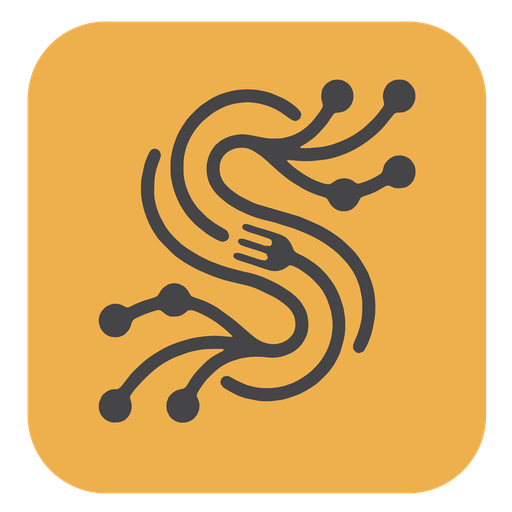

<!--
  Spagitty — a local-first desktop Git client.
  Copyright (C) 2026 The Spagitty Authors
  Licensed under the GNU General Public License v3.0 or later. See LICENSE.
-->

<div align="center">



# Spagitty

**Your gateway to a Git-managed agent farm.**

[](https://github.com/spa-git-ty/spagitty/releases/latest)
[](https://github.com/spa-git-ty/spagitty/releases)
[](https://github.com/spa-git-ty/spagitty/stargazers)
[](https://github.com/spa-git-ty/spagitty/actions/workflows/gates.yml)
[](LICENSE)

[**Download**](https://github.com/spa-git-ty/spagitty/releases/latest) · [**The farm**](#the-agent-farm) · [**Screens**](docs/screens.md) · [**How it is built**](#learn-from-this-repository) · [**Docs**](#documentation)

</div>

---

Spagitty is your gateway to a **Git-managed agent farm** — a local-first desktop
Git client for repositories where people and coding agents commit side by side.
It is where that work is read, reviewed and landed — and now it is where the
agents are *run*: a goal, the tasks it was cut into, and the coding agents
already installed on your machine working them in parallel, each on its own
branch, in its own worktree.

Nothing in Spagitty is a model and nothing here ships a key: the agents are
Claude Code, Codex, Cursor, Oh My Pi or anything else with a command line, run
as you. Nothing leaves the machine unless you ask it to: a forge token you
supply, a fetch you trigger, a pull request you open.

*Untangle the work — yours, and your agents'.* The name is *spa-gi-ty*:
spaghetti + Git. A repository without a readable history is a plate of tangled
pasta. Spagitty straightens the strands so you can see what happened, who did
it, and what to do next.

## Built with

[](https://tauri.app)
[](https://www.rust-lang.org)
[](https://svelte.dev)
[](https://kit.svelte.dev)
[](https://bun.sh)
[](https://github.com/GitoxideLabs/gitoxide)
[](https://webkitgtk.org)
[](https://github.com/spa-git-ty/spagitty/releases)
[](https://github.com/spa-git-ty/spagitty/releases)
[](https://claude.ai)
[](https://openai.com/codex)
[](https://cursor.com)

## Install

Grab a build from [**the latest release**](https://github.com/spa-git-ty/spagitty/releases/latest).
Gate 5 ships Linux, macOS and Windows installers on every publishing merge.

Then open a repository and work. There is no account step and no cloud to log into.

> **Status: 0.x.** The surface is not yet stable — MINOR may break. Every screen
> in the handoff is built (graph through badges), the **agent farm** (screen 1Q)
> is built on top of it, and the release lane tags from the changelog. Remaining
> gaps are named on each screen in [`docs/screens.md`](docs/screens.md).

## The agent farm

**Set a goal. Cut it into tasks. Watch four agents work them at once, on
branches you can read in the graph you already trust.**

| | |
| --- | --- |
| **Agents, not models** | Claude Code, Codex, Cursor and Oh My Pi are detected on `PATH`; anything else with a command line can be added by hand. Spagitty runs them as you — no key of ours, no model of ours, no request to a server of ours |
| **A branch and a worktree per task** | `spagitty-farm/<task>/<provider>`. Nothing an agent does reaches your working copy, and deleting a task keeps the commits on its branch |
| **"Done" is not an agent's to declare** | Verification runs *your* repository's commands in the task's worktree, and review is performed by a different agent than the one that wrote the change. Neither can be skipped by an agent's own report |
| **Agents never talk to each other** | Every handoff goes through Spagitty, so there is one audit trail and one place that decides what happens next |
| **You choose where the human stands** | Five autonomy levels, from *Manual* — nothing runs by itself — to *Unattended*. The setting is a sentence about where you are, not a slider |
| **Dependencies, in a DAG** | A task can depend on another; the ones that can run, run. Up to four at a time |
| **The repository's own rules** | `AGENTS.md` (and friends) is read and attached to every prompt. Spagitty will write you a starter one |
| **Survives a crash** | The farm is JSON under `.spagitty/`, written by rename, with an append-only event log. It is excluded from git, never committed |
| **A scoreboard that is not a leaderboard** | Completed, failed, sent back and first-pass rate, counted *in this repository* — not a claim about which model is better |

The plan is on the left of screen 1Q, the selected task in the middle, and what
just happened along the bottom, so supervising does not mean navigating. Nothing
polls: a farm moves at a model's pace and on no schedule, so the backend emits
and the screen is a function of what it has been told.

The control plane is [`crates/spagitty-farm`](crates/spagitty-farm) — model,
adapters, workspaces, execution, verification, review, orchestrator,
persistence — and it calls `spagitty-core` for every git operation rather than
reimplementing one. The whole feature is written up in
[`FEAT-073`](agile/items/FEAT-073-agent-farm.md) and
[`docs/screens.md`](docs/screens.md#1q--farm).

If you came looking for a hosted forge or a CI system, this is the wrong
repository. Those stay outside.

## Features

| Area | What you get |
| --- | --- |
| **Commit graph** | Lanes, branches and tags, with hide / solo / pin / smart visibility so the walk is rooted where you are looking |
| **Working copy** | Stage and unstage by file, hunk or line; discard with a clear account of what goes away |
| **Diffs** | Syntax highlighting across a dozen grammars; image compare (side by side, swipe, onion skin); binary size deltas; search inside the patch text |
| **File history** | Timeline with rename following, and a line-by-line blame gutter that links back into the graph |
| **Branches of work** | Branches, tags, stashes and reflog as screens; worktrees from the tab strip; submodules update / sync / deinit |
| **Rebase & conflicts** | Interactive rebase planning, in-app conflict resolution, or an external merge tool (VS Code, Meld, Beyond Compare, KDiff3, Sublime, Vimdiff, …) |
| **Pull requests** | GitHub, GitLab and Bitbucket Cloud — read, review with inline comments, create, merge (merge / squash / rebase), close, reopen, mark ready |
| **Log search** | Author, message, path, date range and diff content together |
| **Network** | Clone, fetch and push from the toolbar, with the git command behind each action available when you want it |
| **Identity** | Named profiles for name, email and signing key, switched from the status strip |
| **Signing** | Reads whether git would actually sign (`commit.gpgsign` and friends) — not a Spagitty preference pretending to be that |
| **Attribution** | Commits credited from `Co-authored-by` trailers; humans and agents tracked separately |
| **Agent standings** | Ranked by first-pass rate, never by commit volume |
| **Agent farm** | A goal cut into tasks, worked in parallel by the agents on your machine — one branch and one worktree each, your verification commands in the path, and a review by a second agent before anything is yours to merge |
| **Farm supervision** | Five autonomy levels, a dependency DAG, up to four agents at once, a live activity strip, per-repository standings, and `AGENTS.md` attached to every prompt |
| **Delight layer** | Badges and titles for clean commits, survived rebases, recovered work and conflicts resolved — never for time spent in the app. Personality and Sound settings; God mode in Settings |
| **Chrome** | Command palette, glass window chrome, and eight palette families — Catppuccin, Dracula, Tokyo Night, Gruvbox, Nord, Rosé Pine, Solarized, Everforest — each in light and dark, each accented in its **own** hue and each contrast-checked in tests rather than by eye |

Every screen, by code: [`docs/screens.md`](docs/screens.md) (1A Graph … 1Q Farm).

## Learn from this repository

**This repo is meant to be read, not only run.** The product code is one half.
The other half is the working record — why a change existed, what was verified,
and what broke along the way — kept under [`agile/`](agile/) rather than in
someone's head.

**If you are learning desktop Git UI**, start with the seams, not the screens.
Only `src/lib/api.ts` may call the backend. The Svelte stores never talk to Git
directly; `crates/spagitty-core` never imports Tauri. That boundary is why the
core can be tested without a window, and why a screen that looks broken is
almost always a store bug rather than a Rust one. [`docs/architecture.md`](docs/architecture.md)
is the map.

**If you are interested in agentic coding**, this application was built with
coding agents in the loop *and now runs them* — read
[`crates/spagitty-farm`](crates/spagitty-farm) for the orchestration and
[`FEAT-073`](agile/items/FEAT-073-agent-farm.md) for why it is shaped that way.
The honest account of building it is in [`agile/`](agile/). It is not a demo of
prompting. It is dated items, plans and test sweeps — including the defects
found in passing:

- A Settings chip that opened the wrong section, because eight chips fed seven
  branches and an `{:else}` catch-all hid the miss.
- An External Tools section themed against CSS tokens that did not exist, so
  every palette but one fell through to a hard-coded dark fallback — and nothing
  failed, because the CSS was valid.
- A release lane that tagged `v0.2.0` and then could not attach the assets,
  because a bundle tree was uploaded whole and `icon.icns` appeared twice.
- A coverage floor that the delight layer briefly dropped under, recovered by
  mounting the surfaces FEAT-062 through FEAT-069 had left at 0% branches.
- Eight themes wearing one accent, because "the brand runs through the UI" was
  applied literally: an amber primary button in the middle of Dracula's purples
  and a muddy brown on every light background. Each family accents in its own
  hue now, and a test fails if two ever share one again.
- A rail whose loudest pixel was a filled button offering to replace the
  repository you were working in — above every screen, wanted approximately
  never.

The through-line: the leverage was real, and the verification was never optional.

**If you want the full record**, it is here:

| Read this | For |
| --- | --- |
| [`docs/architecture.md`](docs/architecture.md) | The three layers, and the `api.ts` rule |
| [`docs/screens.md`](docs/screens.md) | Every screen, by code, and what each is for |
| [`docs/testing.md`](docs/testing.md) | What is tested, how, and what is deliberately not |
| [`docs/ci.md`](docs/ci.md) | The six gates, the coverage floor, and when a merge publishes |
| [`docs/branding.md`](docs/branding.md) | Mark, wordmark, palette, and the words we lead with |
| [`docs/AMENDMENTS.md`](docs/AMENDMENTS.md) | Standing rules the working record is written against |
| [`agile/`](agile/) | Every item, plan and test sweep |

### Notes for agents working here

- Prefer [`agile/`](agile/) over inventing process. An item's status there is
  authoritative.
- Do not invent brand copy. Approved wording lives in
  [`docs/branding.md`](docs/branding.md). Regenerate collateral with
  `python3 tools/make-brand.py` and `python3 tools/make-icons.py` — never
  hand-edit the derived PNGs.
- Never use the Git logo or Git orange (`#F05133`). Spagitty is independent.
- Frontend tests run under happy-dom via vitest; Rust tests live beside the
  core. The coverage floor is **branch** coverage — 65% for the frontend, with
  Rust held to 70% lines — not a line count for the whole tree.
- Changelog entries go under `## [Unreleased]` in the same change as the work
  (Amendment 20). Gate 6 reads that file for release notes.

## Privacy

Spagitty has no telemetry, no analytics, no account of ours, and no server of
ours in the path. Repositories stay on disk. Forge personal-access tokens live
in the OS keychain and never in a configuration file. The webview holds neither
a token nor an HTTP client — the only network boundary is `crates/spagitty-core`
talking to the forges you connected, when you ask it to.

## Building

Requires **Rust 1.77+**, **Bun 1.4**, and the platform WebView
(WebKitGTK on Linux).

```sh
git clone https://github.com/spa-git-ty/spagitty.git
cd spagitty
bun install
bun run check          # typecheck
bun run test           # vitest
bun run coverage       # vitest with the coverage floor
bun run tauri dev      # the desktop app
```

The automation contract — six gates, coverage floor, three release lanes — is
[`docs/ci.md`](docs/ci.md). Gates 1 to 3 are what a change is checked against
before it is committed.

## Architecture

Three layers. Each knows nothing about the one above it.

```
src/                      SvelteKit SPA. One store per screen.
  └── invoke ───────────► src-tauri/           Tauri commands, worker, watcher.
                            ├── calls ───────► crates/spagitty-core/   Git, via gix + git.
                            └── calls ───────► crates/spagitty-farm/   Orchestration: agents,
                                                                       worktrees, verification,
                                                                       review — and it calls
                                                                       spagitty-core for git.
```

Only `src/lib/api.ts` crosses from the UI into the backend. Types on the wire are
mirrored by hand in `src/lib/types.ts`. Detail:
[`docs/architecture.md`](docs/architecture.md).

## Documentation

| Document | What it is |
| --- | --- |
| [`docs/architecture.md`](docs/architecture.md) | How the three layers fit, and why |
| [`docs/screens.md`](docs/screens.md) | Every screen (1A–1Q) |
| [`docs/testing.md`](docs/testing.md) | What is tested and what is deliberately not |
| [`docs/ci.md`](docs/ci.md) | Gates, coverage floor, release lanes |
| [`docs/branding.md`](docs/branding.md) | Mark, wordmark, palette, voice |
| [`docs/AMENDMENTS.md`](docs/AMENDMENTS.md) | Standing project rules |
| [`agile/`](agile/) | Working record — items, plans, sweeps |
| [`CONTRIBUTING.md`](CONTRIBUTING.md) | How to send a change |
| [`CHANGELOG.md`](CHANGELOG.md) | What shipped, newest first |

## Contributing

Bug reports and pull requests are welcome. Start with
[`CONTRIBUTING.md`](CONTRIBUTING.md). Branch names and commits carry a work-item
id from [`agile/`](agile/); the pull request is the only path into a protected
branch (Amendment 14).

## Licence

**GPL-3.0-or-later.** See [`LICENSE`](LICENSE) and [`NOTICE`](NOTICE).

The wordmark typeface (Inter) is SIL Open Font License 1.1
(`assets/brand/font/OFL.txt`). Spagitty is not affiliated with the Git project.
Git and the Git logo are trademarks of Software Freedom Conservancy.
